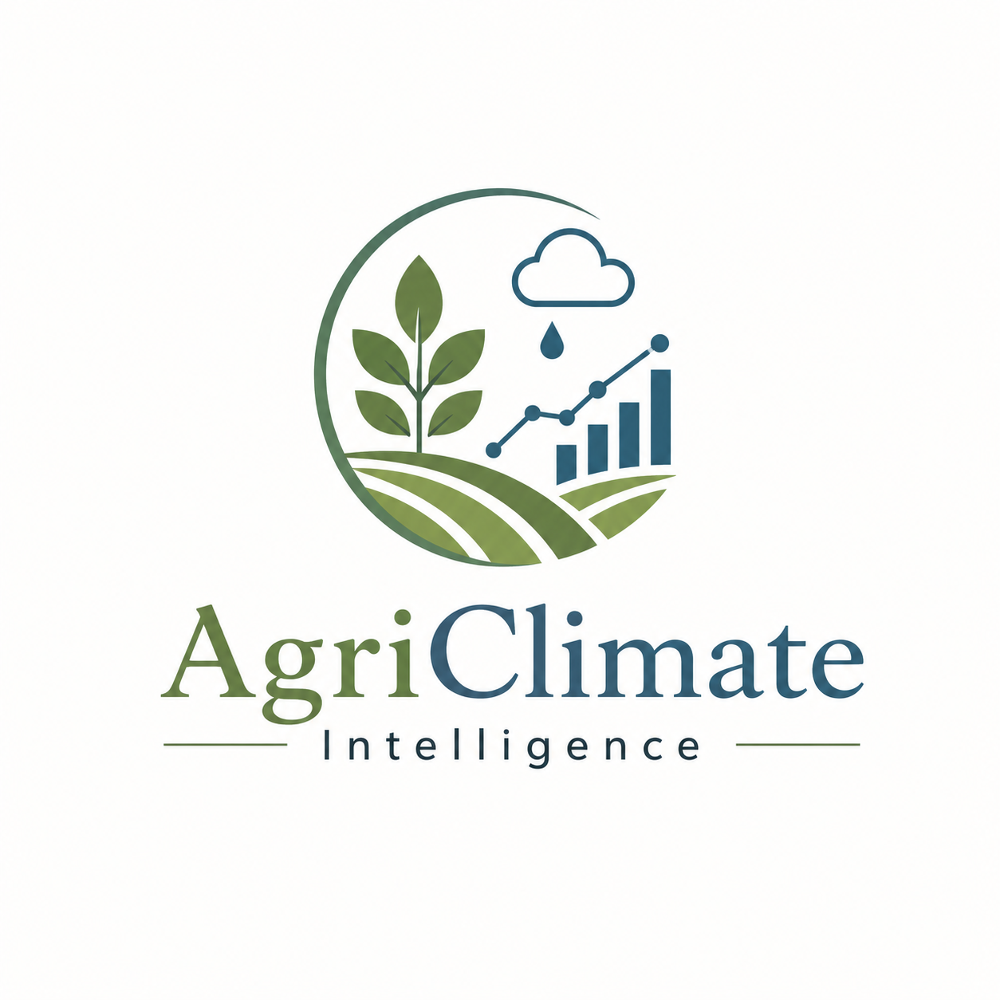
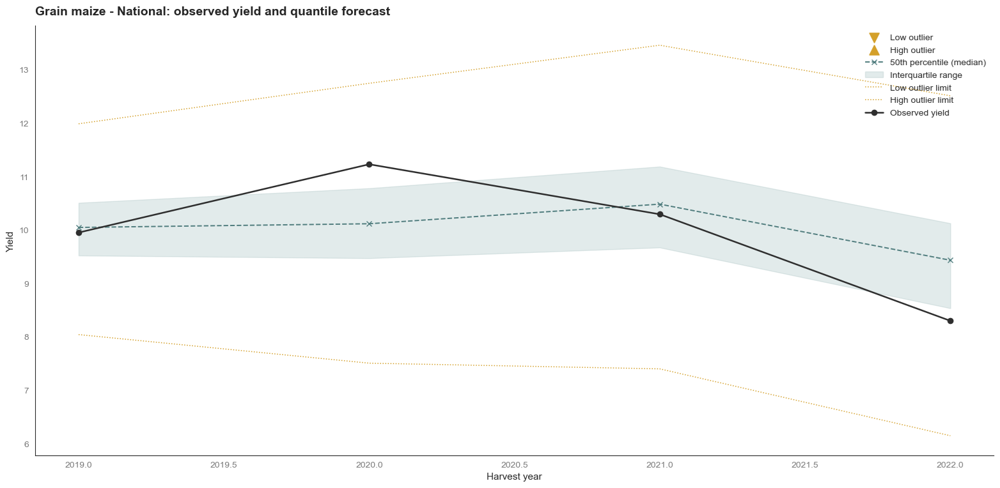
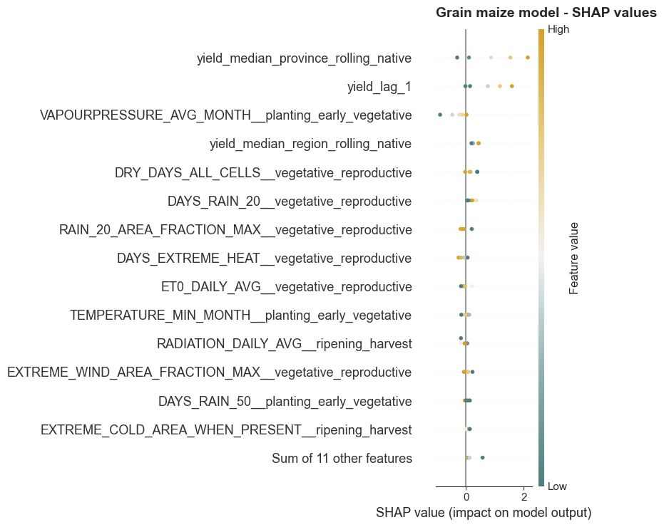
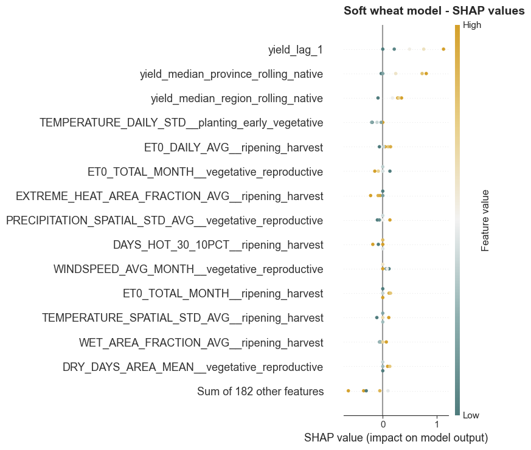
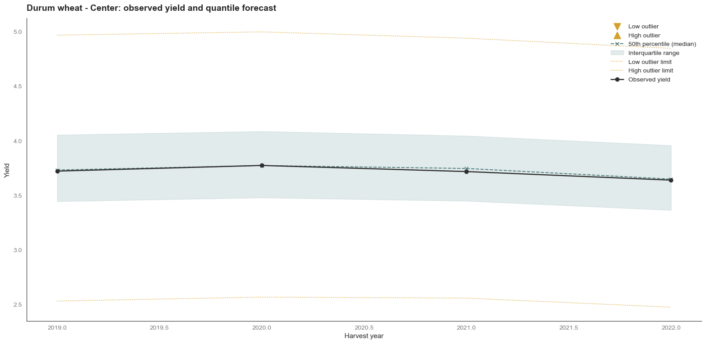
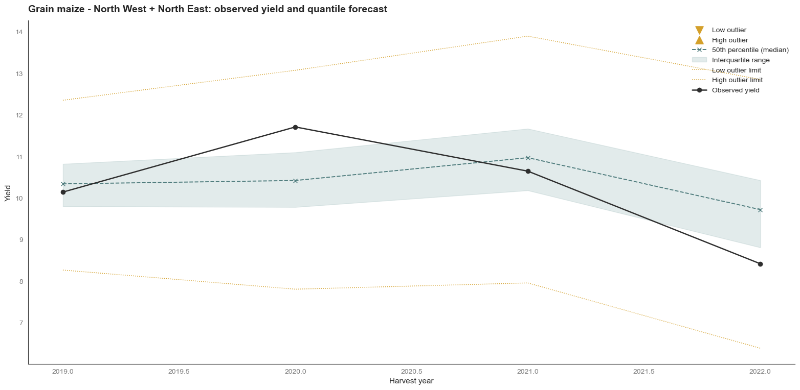

<p align="center">
  
</p>

# AgriClimate Intelligence

**Probabilistic crop-yield modelling for Italy using historical production, climate data, temporal validation and tabular foundation models.**

AgriClimate Intelligence is an end-to-end data science project developed as a Capstone for the **Executive Master in Data Science at Rome Business School**.

The project studies 28 years of sub-national agricultural production in Italy and links annual crop yields to historical productivity and climate conditions. The final modelling workflow produces province-level **conditional yield quantiles** for durum wheat, soft wheat and grain maize, compares classical and nonlinear approaches under strict chronological validation, and evaluates the frozen models on an untouched 2019–2022 test period.

The main analytical result is that agricultural yield is strongly anchored to **recent local productivity and persistent geographical production regimes**, while current-season climate adds incremental predictive information in a crop-specific way.

<!--
IMAGE SOURCE
File to create: images/grain_maize_national_quantile_forecast.png
Notebook: notebooks/ML_Quantile_Modelling.ipynb
Section: "National yield representation"
Exact plot title: "Grain maize - National: observed yield and quantile forecast"
This is one of the three plots generated in the cell immediately below that section.
-->


## Project at a glance

| | |
| --- | --- |
| **Problem** | Estimate annual crop yield and its uncertainty at Italian province level |
| **Crops modelled** | Durum wheat, soft wheat, grain maize |
| **Production history** | 1995–2022 |
| **Climate history** | 1980–2025 |
| **Modelling rows** | 7,576 province × crop × year observations with observed target |
| **Candidate predictors** | 4 historical + 192 crop-phase climate features |
| **Forecast target** | Q1, Q2 and Q3 conditional yield quantiles |
| **Primary metric** | Q2 pinball loss |
| **Model families tested** | Linear quantile regression, SFS, L1 regularization, CatBoost, TabPFN |
| **Model-selection validation** | 2016–2018 |
| **Final untouched test** | 2019–2022 |
| **Cloud stack** | Google Cloud Storage + BigQuery |
| **Main language** | Python |

## Why quantile modelling?

A single point forecast does not describe whether an expected yield is relatively certain or lies inside a much wider range of plausible outcomes.

The project therefore estimates:

```text
Q1 = 25th conditional percentile
Q2 = 50th conditional percentile / median
Q3 = 75th conditional percentile
```

This makes it possible to evaluate not only the central expected yield but also the modelled dispersion around it and to identify crop–year–territory observations that fall unusually far from their estimated historical regime.

## Data pipeline

The repository covers the complete analytical workflow rather than only the final machine-learning experiment.

```text
Daily gridded climate data
          │
          │ validation + spatial aggregation
          ▼
Monthly provincial climate indicators
          │
          ├───────────────┐
          │               │
          │        Agricultural production
          │               │
          └───────┬───────┘
                  ▼
          Curated BigQuery tables
                  │
                  ▼
           Exploratory analysis
                  │
                  │ crop calendars
                  │ phase engineering
                  ▼
          Province × crop × year
             modelling table
                  │
                  ▼
       Chronological model development
                  │
                  ▼
          Frozen final models
                  │
                  ▼
          2019–2022 final test
                  │
                  ▼
   Probabilistic + territorial diagnostics
```

The climate ETL preserves more than simple monthly averages. It includes information about local extremes, spatial variability, affected territorial share, event frequency, consecutive-event duration, precipitation intensity, evapotranspiration, radiation and altitude.

Agricultural-production processing also retains explicit quality information so that structural zeroes, missing source components and reconstructed territorial units are not silently mixed with ordinary observations.

## Exploratory analysis and feature engineering

The EDA is used to define the modelling problem rather than as a separate decorative step.

It covers:

- data consistency, missingness and territorial completeness;
- yield distributions and long-term trends;
- macro-regional production differences;
- temporal persistence and partial autocorrelation;
- altitude and geographical structure;
- reconstruction of crop seasons;
- climate aggregation by agronomically meaningful phases;
- bivariate climate–yield analysis;
- comparison of environmental patterns across crops and Italian macro-regions.

A central EDA finding is that several apparently strong climate–yield relationships are also strongly geographical. This becomes particularly important for durum wheat: environmental variables such as evapotranspiration, radiation, wind and frost exposure show clear associations with yield, but much of the same information is also encoded in persistent territorial productivity differences.

## Leakage-safe model development

The modelling workflow is entirely chronological.

The development period uses expanding temporal folds:

```text
train through 2006 → validate on 2007–2009
train through 2009 → validate on 2010–2012
train through 2012 → validate on 2013–2015
```

The **2016–2018** block is then used as an outer validation set for final model comparison.

Only after the model specification for each crop is frozen are those observations incorporated into the final training data. The selected models are refitted on **1995–2018** and evaluated once on the untouched **2019–2022** test period.

The test set is never used for feature selection, early stopping, hyperparameter decisions, model-family comparison or tie-breaking.

## Models compared

The modelling sequence deliberately moves from simple to more flexible approaches:

1. **Naive persistence** - previous observed yield as a minimum forecasting benchmark.
2. **Linear H** - quantile regression using four historical yield predictors.
3. **Linear SFS** - Sequential Forward Selection over historical and climate variables.
4. **L1 quantile regression** - regularization sensitivity check.
5. **CatBoost** - conventional nonlinear tabular model.
6. **TabPFN** - tabular foundation model evaluated with historical, selected and full feature representations.
7. **Temporal robustness and quantile diagnostics** - tie-breakers for close validation results.

This design makes model complexity something that has to earn its place through out-of-time predictive evidence.

## Final models and test performance

The final model choice is crop-specific:

| Crop | Final model | Information used | Test Q1 | **Test Q2** | Test Q3 |
| --- | --- | --- | ---: | ---: | ---: |
| Durum wheat | **Linear H** | Historical yield only | 0.1756 | **0.2106** | 0.1898 |
| Grain maize | **TabPFN SFS** | Historical + selected climate features | 0.3348 | **0.3759** | 0.2965 |
| Soft wheat | **TabPFN Full** | Historical + full climate feature set | 0.1978 | **0.2393** | 0.2026 |

All values are pinball losses on the independent 2019–2022 test period. Lower is better.

The fact that three crops lead to three different final specifications is itself informative: there is no single universally superior feature representation or model family.

## What the models learned

### Durum wheat - geography is already highly informative

The final durum-wheat model is a compact linear quantile regression using recent yield together with rolling provincial and regional productivity.

The EDA had shown clear climate associations, but many of them followed the same geographical gradient as yield. Once the model already knows what the province and region have historically been able to produce, the explicit climate variables provide insufficient additional out-of-time predictive information to justify the more complex alternatives.

This should **not** be read as evidence that climate is irrelevant. It indicates that, for prediction, a large part of the climate signal is already embedded in persistent territorial production regimes.

### Grain maize - targeted seasonal climate corrections

The final maize model uses TabPFN with the SFS-selected feature set.

Historical productivity remains the dominant baseline, but several climate variables retain incremental value after that baseline is established. Water availability, dry conditions, intense rainfall and thermal extremes during agronomically relevant phases provide targeted adjustments to expected yield.

<!--
IMAGE SOURCE
File to create: images/grain_maize_shap.png
Notebook: notebooks/ML_Quantile_Modelling.ipynb
Section: "Interpreting the TabPFN models with SHAP values"
Exact plot title: "Grain maize model - SHAP values"
This is the Grain maize beeswarm generated by the SHAP loop.
-->


### Soft wheat - distributed environmental information

Soft wheat requires the richest final representation: TabPFN with the full candidate feature set.

Yield history still provides the strongest individual signal, but the environmental adjustment is more distributed than for maize. No single climate feature dominates. Instead, many smaller effects contribute jointly, including water-demand indicators, moisture-related variables, thermal variability and particularly late-season heat stress.

<!--
IMAGE SOURCE
File to create: images/soft_wheat_shap.png
Notebook: notebooks/ML_Quantile_Modelling.ipynb
Section: "Interpreting the TabPFN models with SHAP values"
Exact plot title: "Soft wheat model - SHAP values"
This is the Soft wheat beeswarm generated by the SHAP loop.
-->


## Territorial interpretation

National averages are useful summaries, but they can hide the fact that crops have very different geographical production structures.

The final analysis therefore aggregates province-level predictions over selected macro-regional systems while preserving cultivated-area weighting.

One particularly strong result is obtained for **durum wheat in Central Italy**, where the crop is widely cultivated and the model closely reproduces both the level and the limited year-to-year variability observed during the final test.

<!--
IMAGE SOURCE
File to create: images/durum_wheat_center_quantile_forecast.png
Notebook: notebooks/ML_Quantile_Modelling.ipynb
Section: "Selected territorial views"
Exact plot title: "Durum wheat - Center: observed yield and quantile forecast"
This is the Center plot generated from SELECTED_AREAS["Durum wheat"].
-->


For **grain maize**, cultivation is overwhelmingly concentrated in North West and North East. The model captures the high-yield northern regime and the deterioration observed in 2022, although the magnitude of unusually strong annual movements is harder to reproduce precisely.

<!--
IMAGE SOURCE
File to create: images/grain_maize_north_quantile_forecast.png
Notebook: notebooks/ML_Quantile_Modelling.ipynb
Section: "Selected territorial views"
Exact plot title: "Grain maize - North West + North East: observed yield and quantile forecast"
This is the northern plot generated from SELECTED_AREAS["Grain maize"].
-->


The territorial analysis is not intended as a causal crop-allocation model. It is better interpreted as a **screening and decision-support layer**: it highlights where production is important, where expected productivity appears stable or uncertain, and where realised yield departs materially from the historical regime learned by the model.

## Probabilistic diagnostics

After the official final-test scores are calculated from the raw predictions, the three estimated quantiles are post-processed into a coherent ordered distribution:

```text
0 ≤ Q1* ≤ Q2* ≤ Q3*
```

The resulting interquartile range is used to derive conditional Tukey-style limits.

On the final test:

- Q1–Q3 empirical coverage is close to the nominal 50% for all three crops;
- observed coverage is about **53.1% for durum wheat**, **51.1% for grain maize** and **50.4% for soft wheat**;
- final-test conditional outlier shares remain below 8% for all crops.

These diagnostics complement the pinball-loss evaluation rather than replacing it.

## Main conclusion

> **History and geography define the expected yield of a territory. Climate is partly embedded in that geographical baseline and, where the current season contains additional information beyond it, modifies the prediction in a crop-specific way.**

Across all three crops, recent yield and persistent provincial or regional productivity are the most recurrent signals.

What changes is how much additional current-season environmental information remains after that baseline is known:

- **Durum wheat:** most of the useful climate signal is strongly spatial and largely absorbed by historical territorial productivity.
- **Grain maize:** a relatively compact set of seasonal water- and temperature-related variables adds independent predictive value.
- **Soft wheat:** environmental information is broader and more multivariate, with many individually moderate effects contributing jointly.

The results are **predictive, not causal**. They identify information that improves validated yield prediction; they do not establish that manipulating an individual climate or agronomic variable would mechanically cause the corresponding yield change.

## Technology stack

**Data engineering and cloud**

```text
Google Cloud Storage · BigQuery · pandas · NumPy
```

**Analysis and modelling**

```text
scikit-learn · QuantileRegressor · CatBoost · TabPFN
Sequential Forward Selection · SHAP / shapiq
statsmodels · SciPy
```

**Visualization**

```text
Matplotlib · seaborn
```

## Repository structure

```text
agriclimate-intelligence/
├── .github/
│   └── CODEOWNERS
├── images/                         # README figures to add
├── notebooks/
│   ├── EDA_AgriClimate_Intelligence.ipynb
│   ├── ETL_Climate_Data.ipynb
│   ├── ETL_Climate_Example.ipynb
│   ├── ETL_Production_Data.ipynb
│   ├── ML_Quantile_Modelling.ipynb
│   └── README.md
├── src/
│   ├── __init__.py
│   ├── eda_utils.py
│   ├── modelling_utils.py
│   ├── province_transformation.py
│   └── README.md
├── .gitignore
└── README.md
```

The repository intentionally separates notebook orchestration from reusable code:

- [`notebooks/README.md`](notebooks/README.md) documents each analytical workflow;
- [`src/README.md`](src/README.md) documents the shared Python utilities.

## Suggested reading path

For someone reviewing the project as a portfolio:

1. **This README** - problem, methodology and principal results.
2. [`EDA_AgriClimate_Intelligence.ipynb`](notebooks/EDA_AgriClimate_Intelligence.ipynb) - analytical reasoning and crop-phase feature engineering.
3. [`ML_Quantile_Modelling.ipynb`](notebooks/ML_Quantile_Modelling.ipynb) - full model-development, selection, final-test and interpretation workflow.
4. [`src/`](src/) - reusable ETL, EDA and modelling utilities.

For the complete data-engineering path, start from the ETL notebooks documented in [`notebooks/README.md`](notebooks/README.md).

## Reproducibility notes

Cloud-based ETL and EDA workflows use Google Cloud Application Default Credentials:

```bash
gcloud auth application-default login
```

The modelling notebook currently reads the generated modelling table from:

```text
data/modelling_data.csv
```

TabPFN experiments require an authenticated `tabpfn_client` token stored locally in environment configuration and never committed to the repository.

The **main analytical work is complete**. A small number of repository-quality improvements are planned separately, including:

- direct loading of the modelling dataset from BigQuery;
- a shared `requirements` file;
- additional reproducibility and packaging refinements.

These are engineering and distribution improvements rather than changes to the reported analytical conclusions or final test results.

## Academic context

This project was developed as the Capstone for the **Executive Master in Data Science at Rome Business School**.

It is presented here as a portfolio project demonstrating an end-to-end workflow spanning cloud data engineering, exploratory analysis, temporal validation, probabilistic machine learning, tabular foundation models, model interpretation and domain-oriented communication.
